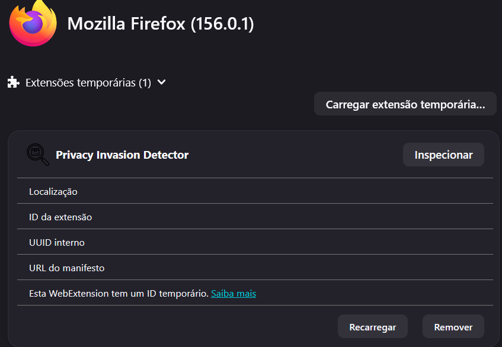

# Cybersec-Ai

## Descrição

Extensão do Firefox que identifica e apresenta os cookies, domínios de terceira parte e armazenamento local carregados pela página atual em que o usuário se encontra no navegador

## Como ativar extensão
1. Acessar a URL about:debugging no navegador FireFox

2. "Este Firefox"

3. "Carregar extensão temporária"

4. Buscar e selecionar manifest.json

5. web-ext lint para verificar se não há problemas com as configurações da extensão

6. web-ext run para executar a extensão

## Como visualisar as informações encontradas pelo script
Acesse a extensão ao clicar no botão de extensões ao lado do perfil do usuário
