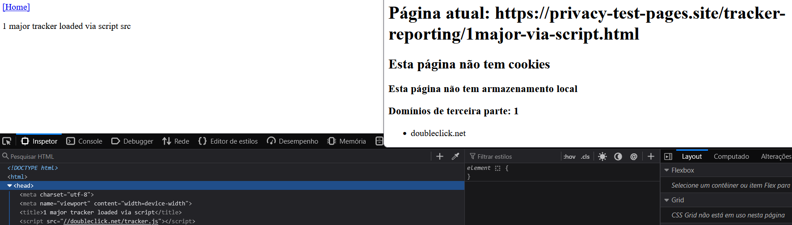
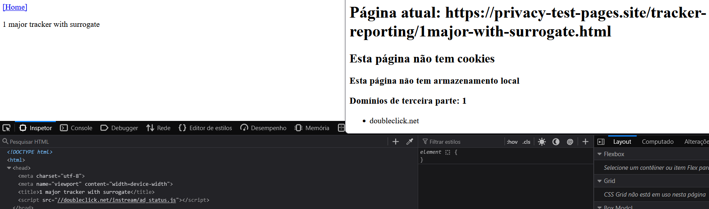
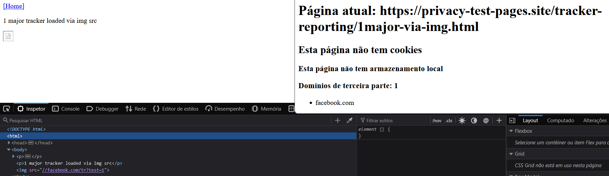
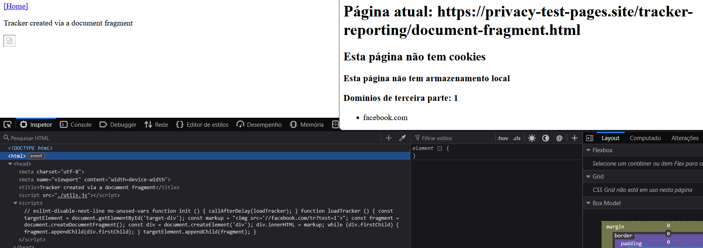
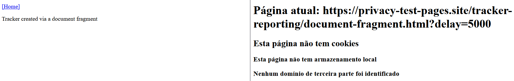
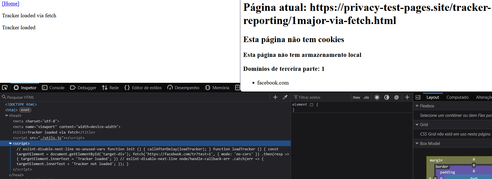
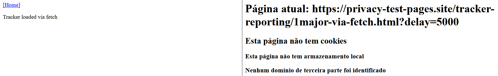
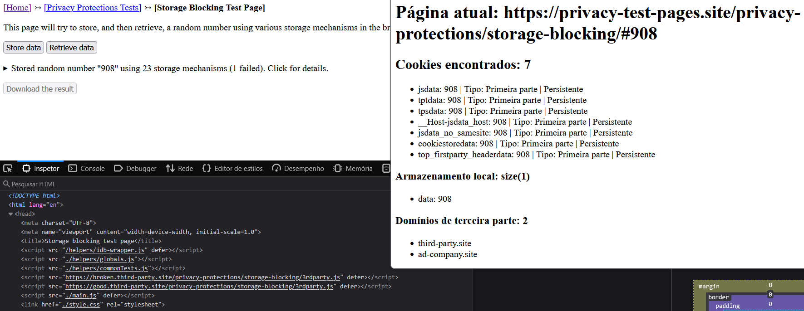
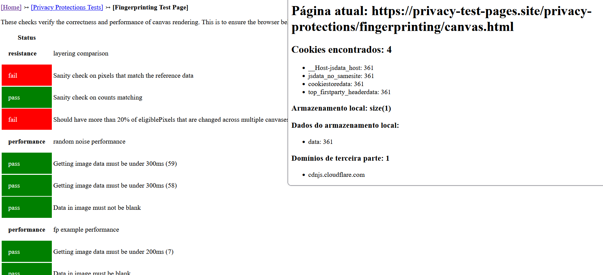

## Relatório de testes de privacidade usando DuckDuckGo Privacy Test Pages

### **1. Tracker Reporting**

| Teste executado | Resultado esperado (reportado pela própria página) | Resultado da extensão | Explicação da divergência |
|---|---|---|---|
| **1 major tracker loaded via script** | Identificação de um major tracker carregado via script src | 1 domínio de terceira parte identificado: `doubleclick.net` | Nesta página, é feita uma requisição para um domínio de terceira parte por meio de um script. A extensão não identifica que a requisição foi feita a partir de um `script`, mas sim que a requisição veio de um domínio de terceira parte e mostra o domínio, neste caso, a requisição foi feita para `doubleclick.net`. |

| | | | |
|---|---|---|---|
| **1 major tracker with surrogate** | Identificação de um major tracker utilizando surrogate. | 1 domínio de terceira parte identificado: `doubleclick.net` | O resultado obtido é o mesmo que o da página anterior, onde essa página faz a requisição a partir de um surrogate, e como explicado no teste anterior, a extensão não encontra o recurso usado para fazer a requisição, mas sim se foi feita para um domínio de terceira parte. |

|  |  |  |  |
|---|---|---|---|
| **1 major tracker loaded via img** | Identificação de um major tracker carregado via `img` | 1 domínio de terceira parte identificado: `facebook.com` | A requisição feita pela página é direcionado para o `facebook.com`, que é um domínio de terceira parte. A extensão identifica isso e mostra o domínio `facebook.com`, mas não o recurso `img` usado para a requisição |

| | | | |
|---|---|---|---|
| **Image loaded via document fragment** | Identificação de um tracker que carrega uma imagem criada usando `document fragment` | 1 domínio de terceira parte identificado: `facebook.com` | A requisição feita pela página é direcionado para o `facebook.com`, que é um domínio de terceira parte. A extensão identifica isso e mostra o domínio `facebook.com`, mas não informa que a imagem foi criada a partir de `document fragment`. Também foi testado a página de delay, a extensão só começou a identificar domínios 5 segundos depois. |

| | | | |
|---|---|---|---|
| **1 major tracker loaded via fetch** | A página verifica o carregamento de um major tracker por meio de uma requisição realizada utilizando `fetch()` | 1 domínio de terceira parte identificado: `facebook.com` | A extensão não identifica especificamente que a requisição foi realizada através de `fetch()`. Identificou que a página fez requisição para o domínio de terceira parte `facebook.com`. Também foi testado a página de delay, a extensão só começou a identificar domínios 5 segundos depois. |

### **2. Storage blocking**

| Teste executado | Resultado esperado (reportado pela própria página) | Resultado da extensão | Explicação da divergência |
|---|---|---|---|
| **Storage blocking** | A página de teste verifica se o navegador/extensão bloqueia o armazenamento usado por um site | Mostrou o dado armazenado e os cookies gerados no processo | A nossa extensão não é responsável por bloquear ou permitir o armazenamento de dados local, mas conseguiu mostrar os dados que estão no armazenamento local.

### **3. Fingerprinting/Canvas**

| Teste executado | Resultado esperado (reportado pela própria página) | Resultado da extensão | Explicação da divergência |
|---|---|---|---|
| **Fingerprinting canvas verification** | Verifica o uso do Canvas e coleta características que podem ser utilizadas para fingerprinting do navegador | Identificou e mostra o domínio de terceira parte que recebeu requisição da página | A extensão não valida se as características do navegador podem ser usadas para fingerprinting, mas sim apresentando dados que encontra da página atual do navegador.

